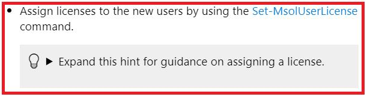

# Challenge and Lab Development Style Guide
This style guide is intended for content developers, testers, and copy editors who are involved in the development of challenges and labs using the Integrated Digital Learning eXperience (IDLx) in the Lab on Demand platform. In IDLx challenges, instructions are authored in IDL-md, a Lab on Demand flavor of markdown that is based on the CommonMark specification. IDL-md provides lab authors with the ability to enhance the user experience with contextual learning material and graphics while keeping a learner focused on the tasks in the lab. 

This guide will provide you with
-	Definitions of each type of challenge.
-	Writing samples that illustrate the language, document structure, and style used in challenges and labs.
-	Best practices and tips for working with some of the most commonly used features of IDL-md. 
-	Document formatting standards.
-	Spelling and grammar standards.
-	A lexicon containing commonly used terms.


## Table of Contents {toc}
- [Challenge definitions](#definitions)
- [Challenge structure](#structure)
 - [Title](#title)
 - [Challenge overview](#overview)
 - [Tasks](#challenge_tasks)
     - [Guided challenge steps](#guided_steps)
     - [Guided challenge hints] (#guided_hints)
     - [Advanced and expert challenge steps](#advanced_steps)
     - [Advanced challenge hints](#advanced_hints)
     - [Challenge formatting](#challenge_formatting)
 - [Check your work](#check_your_work)
 - [Summary](#summary)
- [Getting Started lab structure](#getting_started_structure) 
 - [Title](#lab_title) 
 - [Introduction](#lab_introduction)
 - [Exercises and tasks](#exercises_and_tasks)
     - [Abstract] (#abstract)
     - [Lab steps] (#lab_steps)
     - [Lab formatting](#lab_formatting)
 - [Summary](#lab_summary)
- [Language and documentation best practices](#documentation_best_practices)
 - [Writing best practices](#writing_best_practices)
 - [Standard phrases](#standard_phrases)
 - [Words to avoid](#words_to_avoid)

- [IDL-md best practices] (#md_best_practices)
 - [Define headings in markdown] (#md_headings)
 - [Font formatting] (#font_formatting)
 - [Create copyable text] (#copyable_text)
 - [Use replacement tokens] (#replacementtokens)
 - [Variables] (#variables)
 - [Use embedded URLs] (#urls)
 - [Bullets and numbers] (#bullets_numbers)
 - [Images] (#images)
 - [Special markdown items] (#special_markdown)
 - [Tables] (#tables)

- [Accessibility best practices] (#accessibility)

- [Azure challenges](#azure)
- [Microsoft 365 challenges](#m365)
- [Writing style] (#writing_style)
 - [Spelling] (#spelling)
 - [Grammar and parts of speech] (#grammar)
     - [Verbs](#verbs)
     - [Person] (#person)
     - [Misplaced modifiers](#misplaced_modifiers)
     - [Numbers] (#numbers)
 - [Acronyms] (#acronyms)
 - [Capitalization] (#capitalization)
     - [Title case] (#title_case)
     - [Sentence case](#sentenc_case)
 - [Punctuation] (#punctuation)
    - [Periods] (#periods)
    - [Commas] (#commas)
    - [Apostrophes] (#apostrophes)
    - [Colons] (#colons)
    - [Semicolons] (#semicolons)
    - [Quotation marks] (#quotation_marks)
    - [Dashes and hyphens] (#dashes_and_hyphens)
    - [Ellipses] (#ellipses)
    - [Slashes] (#slashes)
    - [Keyboard commands] (#keyboard_commands)
    - [Symbols] (#symbols)
- [Lexicon] (#lexicon)


===
# Challenge definitions
Each challenge series contains four different types of content.

### Getting started lab
A getting started lab is intended for learners who are new to a product or technology. This is a traditional step-by-step lab that provides comprehensive steps on how to complete a task. Each getting started lab contains a series of 6-10 tasks that help learners to become familiar with the concepts that are covered in the challenge series. Each getting started lab should take an average learner 90 minutes to complete, on average.

### Guided challenge
A guided challenge is intended for learners who have basic familiarity with a concept, but who may be lacking experience and knowledge. Each guided challenge contains a series of 3–5 related tasks that focus on real-world skills. Each guided challenge should take an average learner 30 minutes to complete, on average.

Learners are provided with task-based instructions that simulate a real-world experience. Instructions are action-based and include the input required to complete the task. For learners who need some guidance on how to perform a task, detailed hints are provided in the form of step-by-step instructions, videos, and detailed syntax for commands. Learners can choose to use a hint as needed.

### Advanced challenge
An advanced challenge is intended for learners who have a functional knowledge of a product, and who want to test their level of understanding. Each advanced challenge contains a series of 3-6 related tasks that focus on real-world skills. Each advanced challenge should take an average learner 45 minutes to complete, on average. 

For learners who need some guidance on how to perform a task, each task contains a hint in the form of a URL that takes learners to the product documentation where they can get more information on how to complete the task. Each task is scored so that learners can determine whether or not they completed the task successfully. Each task can be repeated, giving learners the opportunity to test their skills and correct any errors they made while performing a task.

### Expert challenge
An expert challenge is intended for learners who want to test themselves to find gaps in knowledge and skill. This is a true, activity-based assessment. Each expert challenge contains a series of 3-8 related tasks that focus on real-world skills. Each advanced challenge should take an average learner 60 minutes to complete, on average.

Learners are provided with task-based instructions that contain the input required to complete the task; however, learners are not provided with any information on how to complete the task. Each challenge is scored after all tasks are completed. 

[Return to table of contents] (#toc)
===
# Challenge structure {structure}
All three types of challenges share the same basic structure. They all contain an overview that sets the scene for the challenge and outlines the tasks the learner will perform, a series of tasks that contain the configuration requirements the learner will perform, and a summary that highlights what the learner accomplished and provides information about related content that learners can use to build skills.

## Title {title}
The title is one of the most important elements of a challenge. It tells the learners what they should be able to do when they have completed the challenge. All titles use title case.

A guided challenge title must begin with an action verb. Some titles may contain the name of the product or technology that is featured in the challenge. If possible, avoid using the word and in a title. In most cases, when you see the word and, you have two different challenges.

#### Examples
-	Restore Objects in Azure Active Directory
-	Configure a Forest Trust Relationship
-	Manage Active Directory Groups
-	Implement DirectAccess
-	Monitor Windows Server by Using Windows PowerShell

An advanced or expert challenge title is phrased in the form of a question and begins with the words “Can You …?” The title should reflect the key skills being tested in the challenge.

#### Examples
-	Can You Maintain an Active Directory Domain Services Database?
-	Can You Implement and Manage Group Policy?
-	Can You Establish Connectivity for Internet-Based Clients?
-	Can You Configure a Resilient Enterprise That Has Mobile Clients?

[Return to table of contents] (#toc)
===
## Challenge overview {overview}
The challenge overview appears on the title page, under the challenge title, and contains a description of the challenge scenario and a summary of the challenge environment. Learners must select the overview in order to display the contents, so some learners may not read this information.

The overview format is the same for all three types of challenges.

## Understand the scenario
Each challenge contains an introductory paragraph that defines the job role, the requirements of the challenge, and the tasks the learner will perform. 

The opening sentence should state a possible job role associated with the tasks in the challenge. This is your opportunity to add some context to the challenge. 

Do not use phrases like:
- Your boss has tasked you with…
- The CIO wants you to…
- You have been asked to…

Instead, you the phrase "you need to" to introduce the main requirement of the challenge.

#### Examples
-	You are a database administrator.
-	You are a systems administrator.
-	You are a Microsoft 365 administrator.

The second sentence should be in the form of a requirements statement that describes the overall goal of the challenge. Use the phrase “You need to…” to begin your requirements statement. The requirements statement should relate to the title.

#### Examples
-	You need to configure storage for files that are used by a web application.
-	You need to create a new test virtual machine that is based on an existing managed disk.
-	You need to add users to your organization’s Microsoft 365 tenant.

The outcome, often referred to as the abstract, states what a learner will do in the challenge. You write the abstract by using the following style: 
-	“First, you will…Next, you will…Finally, you will….”
-	“First, you will…, and then you will …. Next, you will…, and then you will…. Finally, you will…, and then you will….

This structure is mandatory and works well for three to six tasks. It is an easy fit for a challenge, since the average challenge contains three to six tasks.

>[!Tip] Take a look at your headings and your summary points, and then turn these into sentences. After you have completed your challenge, make sure that you review your overview to ensure that the it still reflects the final tasks in the challenge.

#### Examples
-	First, you will create accounts for users, and then you will assign licenses to the accounts. Next, you will create a security group, and then you will add the users to the group. Finally, you will remove a user’s license.
-	First, you will create an S3 bucket, and then you will enable versioning. Next, you will configure the bucket as a website that allows public access. Finally, you will upload the website files.
-	First, you will define a hub site by using the SharePoint admin center. Next, you will create a new site collection, and then you will associate it with the new hub. Finally, you will modify the default site permissions.

## Understand the environment
This section should contain one or two sentences that describe the technical environment used in the challenge. Keep this simple! 

Use the phrase “You will be using …” when writing about the environment.

- In a challenge that uses virtual machines, state the names of the virtual machines and, if needed, the operating systems installed on the virtual machines. 
- In a challenge that uses services, state the services that have been created by using a script. Only include services that the learner will need to use to complete the challenge. 
    - Service names will use an @lab replacement token, described in more detail in the [replacement tokens] (#replacementtokens) section.
- If your challenge uses four or more virtual machines or services, use a table to display the information.

#### Examples
-	You will be using a pre-configured Azure resource group named @lab.CloudResourceGroup(RG1).Name.
-	You will be using a Windows Server 2016 domain controller named DC01.

### Profile description
The profile description should contain the challenge overview, with a slight modification to remove the job role. Begin the profile description with the phrase "In this challenge, you will ...", and then add to this the requirements statement and abstract you used in the challenge overview.

You also need to add the following boilerplate text to the profile:

- Once you begin the challenge, you will not be able to pause, save, or return to your challenge. Please ensure that you have set aside enough time to complete the challenge before you start.

#### Example
- In this challenge, you will add users to your organization’s Microsoft 365 tenant. First, you will create accounts for users, and then you will assign licenses to the accounts. Next, you will create a security group, and then you will add the users to the group. Finally, you will remove a user’s license.

    Once you begin the challenge, you will not be able to pause, save, or return to your progress. Please ensure that you have set aside enough time to complete the challenge before you start.

### Best practices
- Stick to the pattern! Challenges should all have a similar look and feel, and learners expect to see the same structure in each challenge they perform.
- Authors should review the overview after completing all of the tasks in the challenge to ensure that the overview still describes the challenge correctly.
- Tech reviewers and copy editors should review the overview at the end of their review to ensure that the overview describes the tasks in the challenge.

[Return to table of contents] (#toc)
===
## Tasks {challenge_tasks}

### Plan your challenge tasks
Before you begin to write the tasks for your challenge, plan the challenge structure. Think about the overall goal of the challenge, as well as the tasks you want the learners to perform in order to achieve this goal.

>[!knowledge] A task is a defined goal that a learner must achieve. Tasks contain a series of steps, or requirements, that a learner must complete in order to achieve the goal. Think of a task as something you would complete and then feel that you could take a break.

### Writing task steps in a guided challenge {guided_steps}
In a guided challenge, each task will have at least one step that a learner must perform in order to complete the task. In each instructional step, you tell the learners what to do, provide any required input, and then if needed, finish the step by telling learners which tool they should use to perform the action in the step. You want to tell them *what* to do but not *how* to do it.

#### Examples
- Assign the **Global admin** role to **Amy Rusko** by using the Microsoft 365 admin center.
- Configure the mailbox for Lori Penor to send an Out of Office message for both internal and external users.
- Create a security group named +++Marketing Admins+++ in the Corp > Groups organizational unit (OU).
- Add two users named +++Darlene Rudd+++ and +++Sean Chai+++ to the **HR Admins** group.
- Create a new App Service Plan named ++AppPlan1++ that uses the **Standard S1** pricing tier.

### Writing steps that use cmdlets or methods

When you are writing tasks that require a learner to use a specific cmdlet or method, provide the name of the cmdlet or method in the main instructional step, include a link to the documentation for that cmdlet or method if official documentation is available, and then put the complete code syntax in a hint.

#### Example
-	Assign licenses to the new users by using the [Set-MsolUserLicense](“https://docs.microsoft.com/en-us/powershell/module/msonline/set-msoluserlicense?view=azureadps-1.0”"Set-MsolUserLicense documentation") command.

[Return to table of contents] (#toc)
===
### Writing hints in a guided challenge {guided_hints}
Use an expandable hint to provide learners with the details of how to perform the action in the step. Hints can contain:
- A video that steps learners through what they need to do to perform the action in the step.
- A screenshot that shows the correct configuration and any UI elements the learner must select in order to get to the configuration page.
- An instructional step that uses the what / where / why structure.
- The complete code syntax of any code that’s required.

Each hint should describe one instructional step. Ideally, a learner who knows the product in a challenge should be able to complete a task without any help. However, if a learner is stuck on an individual step, you want to provide the learner with the details of how to succeed. Learners should be able to expand a hint for one step without seeing any other hints for the task. This allows learners to challenge themselves to complete a task with little or no help.

>[!note] If you are asking learners to perform an action for which you have already provided a hint — for example, you ask them to configure a user and provide a hint showing how to do this, and then you ask them to configure a second user — you do not need to provide a second hint that is a repeat of the first hint. Learners can go back and look at the initial hint.

Hints are contained in specific markdown. The summary tag contains a heading that ties the hint to the instructional step. The heading will always being with the phrase "Expand this hint for guidance on", and you will need to complete the sentence as needed for your hint.

>[!tip] Be careful if you're using copy and paste when adding hints! It's easy to copy and paste the basic syntax of the hint, and then forget to change the heading sentence. 
>- Tech reviewers and copy editors should watch for hint headings that do not match the content of the hint.

Each step in a hint should use a first level bullet. Because you have a limited screen width, avoid using second level bullets. If you are tempted to use a second level bullet, you likely have too much information in the hint and should look at the granularity of the main instructional step.

>[!tip] Always make sure that there is a blank line between the tip heading and your first bullet, and between your last bullet or image and the closing tag of the tip.

#### Examples

- Assign licenses to the new users by using the [Set-MsolUserLicense](https://docs.microsoft.com/en-us/powershell/module/msonline/set-msoluserlicense?view=azureadps-1.0"Set-MsoUserLicense documentation") command.

    >[!HINT]<details>
    ><summary>Expand this hint for guidance on assigning a license.</summary>
    >
    >- Run the following command to assign licenses by using Set-MsolUserLicense command:
    >
    >   ```
    >   Get-MsolUser -UnlicensedUsersOnly | Set-MsolUserLicense -AddLicenses $sku
    >   ```
    >
    >   !IMAGE[The Get-MsolUser command in PowerShell](33760ywr.jpg)
    >
    ></details>

     

    !IMAGE[The expanded display of a hint](x187ghm7.jpg)

- Remove the Office 365 E5 license assigned to **Beth Burke** by using the Microsoft 365 admin center.

    >[!HINT]<details>
    ><summary>Expand this hint for guidance on removing a license.</summary>
    >
    >- In the Microsoft 365 admin center, on the navigation menu, expand **Users**, and then select **Active users**.
    >
    >- Select **Beth Burke**, and then select **Manage product licenses**.
    >
    >   !IMAGE[The Manage product licenses option](g5l6clmm.jpg)
    >
    ></details>

    !IMAGE[The collapsed display of a hint](0akm7nya.jpg)

    !IMAGE[The expanded display of a hint](psxoy8cx.jpg)

[Return to table of contents] (#toc)
===
### Writing task steps in an advanced or an expert challenge{advanced_steps}
In an advanced or an expert challenge, each task will have at least one step that a learner must perform in order to complete the task. In each instructional step, you tell the learner what to do, and then provide any required input. Use the same writing style for all types of challenges; however, advanced and expert challenges should not contain the details of which feature to use unless the use of that specific feature is a requirement.

#### Examples
- Assign the **Global admin** role to **Amy Rusko**.
- Configure the mailbox for **Lori Penor** to send an Out of Office message for both internal and external users.
- Create a SQL database named ++db@lab.LabInstance.Id++ on a new logical server named ++sql@lab.LabInstance.Id++, and then configure a Server admin login named ++adminuser++ using ++Passw0rd++ as the password.

[Return to table of contents] (#toc)
### Writing hints in an advanced challenge {advanced_hints}
In an advanced challenge, use an expandable hint to provide more information on how to perform the action in a step; however, unlike guided challenges, the hint should be in the form of a URL that contains information on how to perform the required action.

>[!knowledge] Only use links to official product documentation.

#### Example
- Add the three new users to the **Auckland Staff** security group by using a single action.

    >[!HINT]<details>
    ><summary>Expand this hint for guidance on adding users to a security group.</summary>
    >
    >- Review the following two methods of adding multiple users to a security group: 
    >
    >   [Microsoft 365 admin center](https://docs.microsoft.com/en-us/office365/admin/create-groups/add-or-remove-members-from-groups?view=o365-worldwide"The Office 365 documentation")
    >
    >   [Office 365 PowerShell](https://docs.microsoft.com/en-us/powershell/module/msonline/add-msolgroupmember?view=azureadps-1.0"The Add-MsolGroupmember documentation")
    >
    ></details>

    !IMAGE[The expanded display of a hint in an advanced challenge](udwvf0bi.jpg)

- Create a rule named +++RMS Test+++ that encrypts all email sent to Amy Rusko, and then set Audit severity to **Low**.

    >[!HINT]<details>
    ><summary>Expand this hint for guidance on configuring message encryption.</summary>
    >
    >- Review the documentation on [configuring message encryption](https://docs.microsoft.com/en-us/office365/securitycompliance/set-up-new-message-encryption-capabilities"The configuring message encryption documentation") by using an Azure RMS template.
    >
    ></details>

    !IMAGE[The expanded display of a hint in an advanced challenge](quyl6swx.jpg)

- Record the name of the data loss prevention (DLP) policy you created in the DLP Name text box.

    **DLP Name**     
    @lab.TextBox(DLPRuleName)

    >[!HINT]<details>
    ><summary>Expand this hint for guidance on DLP templates.</summary>
    >
    >- Review the documentation on:
    >
    >   [Using a DLP policy template](https://docs.microsoft.com/en-us/exchange/security-and-compliance/data-loss-prevention/data-loss-prevention"The DLP policy template documentation").
    >
    >   [DLP policy templates supplied in Exchange](https://docs.microsoft.com/en-us/exchange/security-and-compliance/data-loss-prevention/dlp-policy-templates"DLP policy templates supplied in Exchange").
    >
    ></details>

    !IMAGE[The expanded display of a hint in an advanced challenge](6861omp5.jpg)

[Return to table of contents] (#toc)
===
### Challenge formatting {challenge_formatting}
- Use bold format for:
 - something in the UI that a learner must select.
 - something that a learner must verify.
 - keys on the keyboard.

- Do not use bold format:
 - for labels.
 - for menus.
 - for verbs that are part of an instruction but are not part of an instruction to select a UI element.
 - to call out parts of an instructional sentence that are not something in the UI that a learner must select.
 - to help identify the location of an item on a page.

- Use +++Type Text+++ or ++Copy to clipboard++ for values that a learner must type.

>[!knowledge] The formatting in a hint should match the formatting in the main instruction. Although some learners may choose to use a different method of implementing the instruction than what you show in a hint, for consistency, in the main instruction, assume that learners will use the method that you have described in the hint. 

### Hint formatting
The formatting style used in a guided challenge hint is the same as the formatting used for a lab. 

#### Examples
- Verify that the Peering status is **Connected**.
- On the Start menu, expand **Windows Administrative Tools**, and then select **Active Directory Sites and Services**.
- In Active Directory Sites and Services, right-click **Sites**, and then select **New Site**.
- In the Microsoft 365 admin center, on the navigation menu, expand **Users**, and then select **Active users**.
- Enter +++NewYork+++.
- Press **Enter**.

### Best practices for writing challenge tasks
- Create a heading that calls out the purpose of the task. 
- If your task heading contains the word *and*, review the objectives. You may be trying to combine two tasks into one.
- If your task contains a single step, and both the step and the heading use almost identical language, either your task is too granular, or your step is too high level.
- Write steps that tell the learner the action to take and the specific requirements to implement, but not how to perform the action.
- Use a hint in a guided and advanced challenge to provide guidance on how to perform the action.
- Use Type Text or Copy to clipboard for any values that a learner must type.

[Return to table of contents] (#toc)
## Check your work{check_your_work}
Each task in a guided or advanced challenge must contain a check your work section after the task steps. 

### Guided challenge
-	In a guided challenge, use one or more bulleted points that have check boxes.
-	Each point should begin with the word Confirm.
-	Each point should represent a key outcome of the task, but may not map directly to each step in the task.
 - In general, the check your work statements will map to the individual steps. They should never contain information that was not covered in the task.
-	Do not put verification instructions in the check your work section. If learners should perform a verification step, include this in the task steps.

#### Examples
-	Confirm that you created user accounts for Frano Botica and Louisa Wall.
-	Confirm that you assigned licenses to the new user accounts.
-	Confirm that the Corp > Groups OU contains a security group named Network Admins.
-	Confirm that you created a security group named Network Admins in the Corp > Groups OU.

### Advanced challenge
The check your work section in an advanced challenge should contain at least one activity script that will verify whether or not a learner has successfully performed the configuration required in the task. The script should verify that the key outcome of the task was completed, and may also verify additional configuration changes required by the task.

>[!NOTE] Tech reviewers should execute the script **before** performing the task. The script should display the incorrect answer feedback text if no configuration has been performed. 
>
>Copy editors will need to run the challenge to see the script text, and then execute the script to view the incorrect answer feedback message. Although copy editors cannot edit the script, they can provide a comment that contains the correct text, including punctuation.

Each script contains three text elements:
-	**Text** — Contains the verification label that describes what the script verifies.
-	**Correct Answer Feedback** — Contains the success message to display if the learner performed the configuration correctly.
-	**Incorrect Answer Feedback** – Contains feedback to let the learner know what still needs to be configured.

The incorrect answer feedback should be specific enough that the learner can determine what was missed.

Select the **Display Scripts as Task List** check box, select the Custom Evaluation Button Text check box, set the button text to **Verify**, and then select the **Allow retries** check box.

!IMAGE[Script display options](images/k4ho0vji.jpg)

#### Examples
-	Text: Verify that you have promoted DC3 to a domain controller in the Contoso.com domain.
-	Correct Answer Feedback: Congratulations! You have promoted DC3 to a domain controller in the Contoso.com domain.
-	Incorrect Answer Feedback: You still need to promote DC3 to a domain controller in the Contoso.com domain.

    !IMAGE[The three text elements of a script](x8fg73lg.jpg)

    !IMAGE[The verification script showing three scripts displayed inline](r0ytsqpu.jpg)

    !IMAGE[The output of the script showing the incorrect answer feedback](vd24e3sw.jpg)

    !IMAGE[The output of the script showing the correct answer feedback](ly6k09u6.jpg)

[Return to table of contents] (#toc)
===    
## Summary {summary}
This section summarizes the tasks learners performed in the challenge. The list of tasks should relate directly to the abstract you used in the challenge overview. Use the past tense, and use active verbs.

#### Examples
- Managed Active Directory group membership by using Group Policy.
- Enumerated Active Directory group membership by using Windows PowerShell.
- Created Office 365 user accounts.
- Created an Office 365 group.

At the end of the summary, provide a list of other, related challenges in the series. 

Examples
- GUIDED CHALLENGE: Configure SharePoint Online
- ADVANCED CHALLENGE: Can You Configure Rights Management?
- EXPERT CHALLENGE: Can You Manage Office 365?

The summary section contains some boilerplate text as part of the template. You will need to add your challege title. Please ensure that this matches the final title for the challenge.

[Return to table of contents] (#toc)
===
# Getting Started lab structure {getting_started_structure}

A Getting Started lab should introduce learners to the key concepts and products that will be covered in the challenges in the series. The lab doesn’t need to cover all of the tasks performed in all of the challenges, but after completing the lab, learners should be familiar with the tools and environment that they will encounter in the challenges. 

>[!TIP] Write your lab after you have written the challenges. You may find that topics change slightly as you work on individual challenges. Writing the lab after you have finished the challenges gives you an opportunity to review the overall challenge series and focus on the key concepts the learner will need to know. 
>
>Use input from reviews to help determine any topics that might benefit from extra practice for learners.

>[!TIP] Reviewers should review the Getting Started lab after they have reviewed all of the other challenges in the series. 
>- Tech reviewers should call out any concepts that are covered in the lab but not in the challenges. 
>- Copy editors may save time by going back to the reviews of the challenges in the series to review language and technical names for consistency.

## Title {lab_title}
The title tells the learners, at a high level, the tools to which the learner will be introduced in the lab. All titles use title case.

A Getting Started lab title always begins with the phrase “Getting Started with”, and may include a rephrasing of the name of the challenge series.

#### Examples
-	Getting Started with Windows Server Networking
-	Getting Started with Active Directory Infrastructure Management
-	Getting Started with Active Directory Domain Services

===
## Introduction {lab_introduction}
The introduction to a Getting Started lab is similar to a challenge overview, but without the job role. The lab introduction begins with a sentence that describes the overall goal of the lab.

In the introduction to a Getting Started lab, add one or two sentences that outline the technology used in an exercise or a task. You want the learner to understand why the technology is used.

#### Examples
- In this lab, you will configure a Windows Server core network.
- In this lab, you will configure an Active Directory infrastructure.
- In this lab, you will configure an Azure hybrid cloud solution.

The outcome, often referred to as the abstract, states what a learner will do in the lab. The abstract is written in a prescribed style. 
-	First, you will…Next, you will…Finally, you will….
-	First, you will…, and then you will …. Next, you will…, and then you will…. Finally, you will…, and then you will….

This structure works well for three to six tasks. It is an easy fit for a lab, since the average lab contains approximately six tasks.

>[!tip] Take a look at your headings and your summary points, and then turn these into sentences in the abstract. If you have more than six tasks, look at any exercise headings. These may describe a higher-level goal that would be suitable for the abstract. After you have completed your lab, make sure that you review your overview to ensure that the it still reflects the tasks in the lab.

#### Examples
- First, you will verify IPv4 connectivity, and then you will establish Dynamic Host Configuration Protocol (DHCP) failover. Next, you will configure a Domain Name System (DNS) secondary zone, and then you will configure a Web Application Proxy (WAP). Finally, you will configure a virtual private network (VPN) connection, and then you will configure a Distributed File System (DFS) namespace and DFS replication.
- First, you will promote a server to a read-only domain controller, and then you will configure a domain-wide password replication policy. Next, you will manage Active Directory sites and monitor Active Directory Domain Services replication, and then you will configure a forest trust relationship. Finally, you will configure an Active Directory backup, and then you will restore deleted objects to Active Directory.
- First, you will deploy an Azure web app by using deployment slots, and then you will enable load balancing for the web app. Next, you will configure virtual networks, and then you will enable high availability by using availability sets. Finally, you will enable Azure virtual machine scale sets to provide high availability and scalability.

##### Complete example
- In this lab, you will configure a Windows Server core network. First, you will verify IPv4 connectivity, and then you will establish Dynamic Host Configuration Protocol (DHCP) failover. Next, you will configure a Domain Name System (DNS) secondary zone, and then you will configure a Web Application Proxy (WAP). Finally, you will configure a virtual private network (VPN) connection, and then you will configure a Distributed File System (DFS) namespace and DFS replication.

>[!knowledge] The Introduction heading uses a Heading 1 style.

### Understand the environment
This section should contain one or two sentences that describe the technical environment used in the lab. Keep this simple! 

>[!knowledge] Use the phrase “You will be using …” when writing about the environment.

-	In a lab that uses virtual machines, state the names of the virtual machines and, if needed, the operating systems installed on the virtual machines. 
-	In a lab that uses services, state the services that have been created by using a script. Only include services that the learner will need to use to complete the lab.
-	If your lab uses three or more virtual machines or services, use a table to display the information.

#### Examples
- In this lab, you will be using an Azure virtual machine named LabVM that has been provisioned for you. 
- In this lab, you will use a Windows Server 2016 domain controller named DC01 and a Windows Server 2019 server named SVR01.

>[!knowledge] The Understand the environment heading uses a Heading 3 style and should be placed on the same page as the introduction.

[Return to table of contents] (#toc)
===
## Exercises and tasks {exercises_and_tasks}

### Plan the exercises and tasks
Before you begin to write the tasks for your lab, plan the lab structure. Think about the overall goal of the lab, as well as the tasks you want the learners to perform in order to achieve this goal. 
A task is a defined goal that a learner must achieve. Tasks contain a series of steps, or requirements, that a learner must complete in order to achieve the goal. Think of a task as something you would complete and then feel that you could take a break. If you have a group of related tasks, you may want to group them into an exercise.

### Exercise heading {abstract}
Your exercise heading should reflect the overall goal of all the related tasks. Each heading should begin with an action verb. 

>[!knowledge] If your exercise heading contains the word and, look for a higher-level goal. You may be trying to create an exercise heading by combining two task headings rather than looking at what the learner will accomplish by performing all of the tasks in the exercise.

### Exercise abstract
Each exercise must have an abstract that summarized what learners will do in the tasks that are contained in the exercise. The abstract uses a similar format to the abstract in the introduction. You may be able to use a single sentence, or, if there are multiple tasks, you may need to use three sentences.
-	In this exercise, you will [state the overall goal of the exercise]. First, you will [state the outcome of the first task]. Next, you will [state the outcome of the second task]. Finally, you will [state the outcome of the third task], and then you will [state the outcome of the fourth task, as appropriate].
-	In this exercise, you will [state the overall goal of the exercise]. First, you will [state the outcome of the first task], and then you will [state the outcome of the second task].
Simplified format:
-	In this exercise, you will [state the outcome of the first task], and then you will [state the outcome of the second task].

#### Example
- In this exercise, you will configure additional user principal names (UPNs) for the domain. First, you will add a new UPN to the contoso.com domain by using Active Directory Domains and Trusts. Next, you will assign the UPN to a user account. Finally, you will associate a specific UPN to all existing users in a specific Organizational Unit (OU) by using Windows PowerShell.

After the abstract, you may want to include a paragraph that highlights some of the features of the product or technology that learners will use in the exercise. This might also contain a link to the product documentation for learners who want more information.

### Task heading
Each task heading should reflect the goal of the task. 

>[!knowledge] Each task heading should begin with an action verb. If your task heading contains the word and, review the objectives. You may be trying to combine two tasks into one, or your heading may be too granular.

### Task abstract
Each task must have a one sentence abstract that summarizes what learners will do in the task. The abstract uses a similar format to the abstract in an exercise. There are two different formats that you can use depending on the complexity of the task.

#### Example — simple form
-	In this task, you will [state the first goal of the task], and then you will [state the second goal of the task].
-	In this task, you will [state the goal of the task].

#### Example — complex form
-	In this task, you will [state the overall goal of the task]. First, you will [state the first goal of the task]. Next, you will [state the second goal of the task]. Finally, you will [state the third goal of the task].

[Return to table of contents] (#toc)
===
### Exercise and task formatting {lab_formatting}
-	An exercise heading uses the Heading 1 style. Each exercise begins on a new page.
-	When a task is part of an exercise, the task heading uses the Heading 2 style. The first task is placed on the same page as the exercise heading and abstract, and each subsequent task begins on a new page.
-	When a task stands alone and is not part of an exercise, the task heading uses the Heading 1 style. Each task begins on a new page.

[Return to table of contents] (#toc)
===
### Writing task steps in a lab {lab_steps}
In a getting started lab, each task will have multiple steps that a learner must perform in order to complete the task. Tasks are written in a step-by-step format.

Engaging lab steps should be clear and easy for learners to follow. Using a consistent style will help to keep learners focused. 

The following writing best practices will help you to keep learners engaged:
-	Use the structure “where, what, why”.
-	Use one sentence per step.
-	Provide context to help learners understand how the technology can benefit them.

#### Where, what, why
A learner may only read the first part of a sentence. If you start with the explanation of what you want the learner to do, and then write the instructions at the end of the sentence, many learners will only read a few words in your explanation, and then they’ll try to figure out how to perform the step on their own. This often leads to errors and frustration. By using the “where, what, why” structure, you’ll ensure that the key instruction is conveyed first before you provide the explanation.

- **Where:** If the learner must move to a different location on the screen, tell the learner where to perform the task before stating what the learner should do.
- **What:** State what the learner should do. Your directions should be very specific, with no options. Provide specific user names, passwords, and information messages.
- **Why:** Explain why the learner is performing the action unless the purpose is very obvious. This helps the learner to understand the benefit of each action and why it’s important to them.

#### Examples
-	In Cloud Shell, run the following command to create a key pair.
-	Select **Mount Storage** to mount the storage that uses the file share named shell.
-	In the Cloud Shell region, select **East US**.
-	On the DemoVM blade, select **Connect**, and then download the RDP file.

#### Use one sentence per step
Lab instructions should only contain one sentence per step. This is particularly important in labs that use the IDLx.

Visually, each numbered step contains an action that the learner must complete. 

>[!knowledge] You can combine two short actions into one numbered step if they are performed in the same window or page.

-	Always use complete sentences.
-	Use a knowledge block in IDL-md if you have additional information that you want to convey to learners. This provides a visual separation between your instructional step and the additional information.

#### Context - what’s in it for me
Your labs should always provide enough context to answer the learner’s question: “What’s in it for me?” This means providing clear, concise instructions that also offer an explanation so that learners understand how to apply what they’re learning to their real-world environment.
-	Include the reason they’re performing the step.
-	Add knowledge blocks and notes to provide additional context.
-	Use URLs to take the learners to additional information about your lab topic.

>[!knowledge] Remember that a getting started lab is your opportunity to teach.

[Return to table of contents] (#toc)
===
## Summary {lab_summary}
This section summarizes the tasks that learners performed in the lab. The list of tasks should relate directly to the abstract you used in the lab introduction. Use the past tense, and use active verbs.

#### Examples
-	Managed Active Directory group membership by using Group Policy.
-	Enumerated Active Directory group membership by using Windows PowerShell.
-	Created Office 365 user accounts.
-	Created an Office 365 group.

The summary section contains some boilerplate text as part of the template. You will need to add your lab title. Please ensure that this matches the final title for the lab.

[Return to table of contents] (#toc)
===
# Language and writing best practices {documentation_best_practices}
This section contains some language and writing best practices, as well as tips for writing a successful lab or challenge. This section also contains some boilerplate instructions that you should reuse in your labs and challenges.

## Write engaging instructions {writing_best_practices}
Engaging challenge or lab steps should be clear and easy for learners to follow. Using a consistent style will help to keep learners focused. The following writing best practices will help you to keep learners engaged:
-	Use one sentence per step.
-	Use the structure “where, what, why” for labs and hints.
-	Provide context to help learners understand how the technology can benefit them.

### Use one sentence per step
Challenge instructions should contain one sentence per step. This provides clarity for the learner, and it improves readability in the IDLx environment.

Visually, each step is an action that a learner must complete. You can combine more than one short action into one step if they are all related — for example, all actions are performed on the same page or window.
-	Always use complete sentences.
-	Begin each challenge step with an action verb that describes the primary action performed in the step. 

#### Challenge examples
-	Assign a Global admin role to Amy Rusko by using the Microsoft 365 admin center.
-	Add two users named +++Darlene Rudd+++ and +++Sean Chai+++ to the **HR Admins** group.
-	Create a new Active Directory site named +++Tokyo+++.
-	Enable static hosting for the **labfiles-@lab.LabInstance.Id** bucket.
-	Create a server group named +++File and Print Servers+++, and then add the **FS01** and **FS02** servers to the group.

#### Lab examples

1. [] On the AATSDB SQL database resource menu, select **Geo-Replication**.
1. [] In Group name, enter +++Network Admins+++, in Group type, select **Distribution**, and then select **OK**.
1. [] In the New York OU, right-click **Social Media**, select **Properties**, and then on the Object tab, clear the **Protect object from accidental deletion** check box.
1. [] Run the following command to verify that Kim Yoshida and Linda Kobari are now in the Tokyo OU:
1. [] On the Configure blade, select the **Looking for basic, standard, premium?** tile to switch to the DTU pricing model. 

[Return to table of contents] (#toc)
## Language best practices
You should strive to use clear, consistent language in your content. This section contains some language best practices and some examples for you to follow in your labs and challenges.

### Use neutral verbs
Where possible, use neutral verbs when there are different ways to perform an action. 

#### Examples
-	Open **File Explorer**.
-	Open **Windows PowerShell**.
-	Display the **MyStorage** storage account.
-	Display the **CreateTa88ble method.

### Think about your intended audience
The language you use and the detail you provide may depend on your intended audience. If your audience should know how to open File Explorer or Windows PowerShell, let them use their preferred method. On the other hand, if you are creating a Getting Started lab or a hint for a guided challenge, your audience may need additional guidance, and you’ll want to guide them through a specific way of performing the action.

#### Examples for guided challenges
-	Open **File Explorer**.
-	Display the **MyStorage** storage account.
-	Open the **Azure Marketplace**.

#### Examples for Getting Started labs
-	On the taskbar, select **File Explorer**.
-	On the left navigation bar, select **All resources**, and then select **MyStorage**.
-	Select **Create new resource** to open the Azure Marketplace.

### Write clear headings
A good heading tells learners what they will do in an upcoming task or exercise. When you are writing your headings, start with a verb, and use articles like “a” and “the”. 

- Don’t use a period at the end of a heading.
- Use sentence case. This means that you capitalize the first word in the heading, but do not capitalize other words in the heading unless you are referring to a product that is capitalized in the product documentation.

#### Examples
- Configure a domain-wide password replication policy
- Create an Active Directory site link
- Back up Active Directory
- Enable load balancing by using Traffic Manager

### Prompt learners to save changes
In a guided challenge hint or a starter lab, you should prompt learners to save changes, confirm configuration updates, or close windows that are no longer needed. 

In a service-based environment where the user interface changes frequently, avoid using terms like *select OK* or *select Save*. Those elements may not be the same in a few months, and then you’ll need to update your instructions. Instead, prompt learners to confirm the selection or save changes.

#### Examples
-	In the IP address range, enter +++1.1.1.0+++, and then save your changes.
-	In the Page title, enter +++My Title+++, clear the **Enabled** check box, and then confirm the updates.

[Return to table of contents] (#toc)
===
## Standard phrases {standard_phrases}
This section contains some standard phrases to use in your challenges and labs.

Use the following phrases as a tip the first time you use copyable text in your challenge or lab instructions:

>[!TIP] Select the ++Copy to clipboard++ icon to copy the text string to the clipboard.

>[!TIP] Select the +++Type Text+++ icon to enter the associated text into the virtual machine.

Use the following phrase the first time you switch virtual machines in a lab:

>[!TIP] Select the @lab.VirtualMachine(DC1).SelectLink icon to switch to the DC1 virtual machine.

Use the following phrase to direct learners to sign in to a virtual machine:

- Sign in to @lab.VirtualMachine(SVR1).SelectLink as +++@lab.VirtualMachine(DC1).Username+++ using +++@lab.VirtualMachine(DC1).Password+++ as the password.

Use the following phrase to direct learners to sign in to Azure:

- Sign in to the Azure portal as ++@lab.CloudPortalCredential(1).Username++ using ++@lab.CloudPortalCredential(1).Password++ as the password. 

## Words to avoid {words_to_avoid}
Some words can have multiple meanings. This can be confusing for learners who are not familiar with colloquial English. 

Use the word **named** instead of the word **called** when describing the name of an item. In most products, the label for a name uses the word name; however, many authors use the word called to refer to a name. 

#### Examples
- Create a variable named +++MyVariable+++.
- Create an Organizational Unit (OU) named +++New York+++ in the +++contoso.com+++ domain.

The word **with** can have multiple meanings. Consider the sentence “I hit the man with the bat.” This could have two meanings:
- I hit the man who was holding the bat.
- I hit the man by using the bat.

These two sentences have quite different meanings! In labs and challenges, the second example is usually correct.

#### Examples
Instead of
- In this task, you will configure a forest trust *with* two-way authentication.

Write
- In this task, you will configure a forest trust *by using* two-way authentication.

Use the word **computer** instead of the word **machine** unless you are referring specifically to a virtual machine.

#### Examples
Instead of
- Save the file on your machine.

Write

- Save the file on your computer.

Avoid the use of the word **navigate** in web pages, trees, and the file system.
- In web pages, use **go to** to describe the URL.
- In trees, use **expand**.
- In the file system, use **go to**, and make sure that you provide the full file path.

Use the word **enter** instead of the word **type**. There are many ways that a user can enter text. The physical keyboard is only one possible way.

Use the word **select** instead of the word **click**, with the exception of the instruction to right-click an item. There are many ways that a learner can perform the traditional click action depending on the device and the learner's accessibility requirements.

Avoid the use of the words above and below as an adjective preceding a noun—the instructions above—or following a noun—the code below. 

#### Examples
Instead of 
- Use the settings in the table below.
- Enter the URL in the text box below.
- Repeat the steps above.

Write

- Use the settings in the following table:
- Enter the IP address in the IP Address text box.
- Repeat steps 1-5.

[Return to table of contents] (#toc)
===
# IDL-md best practices {md_best_practices}

This section contains tips for working with markdown and content formatting in IDL-md.

## Define headings for your content {md_headings}

Markdown uses specific characters to define the format of your headings. Each heading style is defined by a # symbol in IDL-md.

# Heading 1 
- Use the Heading 1 style for all task headings in a challenge. Each task begins on a new page.
- In a lab, use the Heading 1 style for all exercise headings. Each exercise begins on a new page.

    !IMAGE[The Heading 1 markdown](27mc6wov.jpg)

    !IMAGE[The Heading 1 display](u7t0b82y.jpg)

- When a task stands alone and is not part of an exercise, the task heading uses the Heading 1 style.


## Heading 2
- In a challenge, the following sections use the Heading 2 style:
 - Understand your environment
 - Understand the scenario
 - Check your work

- In a lab, when a task is part of an exercise, the task heading uses the Heading 2 style. 
 - The first task is placed on the same page as the exercise heading and abstract.
 - Each subsequent task begins on a new page.

    !IMAGE[The Heading 2 markdown](6u7tom4m.jpg)

    !IMAGE[The Heading 2 display](46vcjbul.jpg)
     
## Add page breaks
You insert a page break by using === in IDL-md. 
- Text that uses the Heading 1 or 2 style will display the heading text in the navigation buttons at the bottom of a page, as long as the heading contains a maximum of 40 characters.

    !IMAGE[The display of Heading 1 or 2 text in a navigation button](mc9csu2z.jpg)

[Return to table of contents] (#toc)
===
## Font formatting {font_formatting}
In IDL-md, you need to maintain a clean, easy-to-read document layout. You want to maintain a consistency of style throughout the challenge instructions to make it easier for a learner to focus on the tasks in your challenge.

- In the IDLx, only apply bold formatting to UI elements with which a learner interacts. The overuse of bold formatting makes it difficult for a learner to focus on the key UI elements.
 - In IDL-md, use two asterisks \(**) or an underscore on either side of the text to which you want to apply bold format — for example, \**Item to format**.

    **Overuse of Bold format**
    !IMAGE[The overuse of bold format](utpd1vks.jpg)

    **Correct use of Bold format**
    !IMAGE[The correct use of bold format](nj39zu3u.jpg)

    >[!knowledge] Some technical style guides call for the use of bold formatting for every UI element, not just the ones with which a learner interacts. This is a traditional style often used in documents or web pages in which the instructions are spread out over a larger area.

- Use bold format for a status a learner must identify.

    - Verify that the Peering status is **\**Connected****.

- If you are using the ++Copy to clipboard++ or the +++Type Text+++ features, do not apply bold formatting. These features make the need for user interaction obvious.

    !IMAGE[Type text formatting in markdown](4sdau4ri.jpg)

    !IMAGE[Type text formatting as displayed to the user](hgl9d8cg.jpg)


- In knowledge blocks, notes, alerts, and tips, avoid the use of bold formatting. If you need to call out a specific item, use italics.

-	In IDL-md, use one asterisk \(*) on either side of the text to which you want to apply italic format.

    !IMAGE[The use of italics formatting in a note in markdown](3jib9okg.jpg)

    !IMAGE[The use of italics formatting in a note as displayed to the user](tfm2argl.jpg)

### Quotation marks
Only use quotation marks when you need to: 
- Use a direct quote from a source that you are referencing.
- Define code that contains quotation marks. Code that contains quotation marks should be placed in a fenced code block or should use the Copy to clipboard or Type Text features.
-	In IDL-md, you can catch the reader’s eye by using italics rather than quotation marks.

[Return to table of contents] (#toc)
===
## Create copyable text {copyable_text}
Everything that you want a learner to enter into a text box, a configuration setting, or a code window should be configured to use copyable text. This saves time for learners, prevents typing errors, and allows learners to focus on the learning concepts of your lab rather than on entering text. 

There are two available options for copyable text: Copy to clipboard and Type Text. The markdown syntax and the display of the two options is slightly different, but the benefit to the learner is the same.

### Standard language
Use the following phrases as a tip the first time you use copyable text in your challenge instructions:
>[!TIP] Select the ++Copy to clipboard++ icon to copy the text string to the clipboard.
>[!TIP] Select the +++Type Text+++ icon to enter the associated text into the virtual machine.

### Copy to clipboard
The Copy to clipboard feature in the markdown allows you to define text or code items that a learner can copy from the instructions and paste into a web browser in the lab environment. To use the Copy to clipboard feature, surround the ++copyable text++ with two + signs. 

!IMAGE[The use of the Copy to clipbloard feature in markdown](97x6roj4.jpg)

!IMAGE[The use of the Copy to clipboard feature as displayed to the user](ywk6ifdd.jpg)

### Type Text 
The Type Text feature in the markdown is used in a virtual machine environment and allows a learner to enter text or code items directly into a virtual machine. To use the Type Text feature, surround the +++copyable text+++ with three + signs.

!IMAGE[Type text formatting in markdown](4sdau4ri.jpg)

!IMAGE[Type text formatting as displayed to the user](hgl9d8cg.jpg)

#### Tips for working with copyable text
- When working with the Copy to clipboard and Type Text features, ensure that there is no space between the + signs and the text contained between them.
- Copyable text can contain a + sign.

[Return to table of contents] (#toc)

===
## Use replacement tokens for lab-specific input {replacementtokens}
Replacement tokens are used for input that is specific to a running instance of a lab or challenge, or to any virtual machines used in the lab or challenge. Labs or challenges that use cloud resources will have replacement tokens that are specific to the cloud resources used. Replacement tokens all begin with @lab and use the syntax @lab.replacementTokenName. You can add bold format to the markdown, or you can make the replacement token copyable. 

#### Examples

- Sign in to @lab.VirtualMachine(DC1).SelectLink as +++@lab.VirtualMachine(DC1).Username+++ using +++@lab.VirtualMachine(DC1).Password+++ as the password.
- Sign in to the Azure portal as ++@lab.CloudPortalCredential(1).Username++ using ++@lab.CloudPortalCredential(1).Password++ as the password.
- On the Custom deployment blade, in Resource group, select **@lab.CloudResourceGroup(1769).Name**.

The Learn on Demand Systems help documentation article on [replacement tokens](https://docs.learnondemandsystems.com/lod/feature-focus/cloud-resource-templates/replacement-tokens.md) provides more information on how to use these in a lab or challenge.

[Return to table of contents] (#toc)

===
## Use variables {variables}
IDL-md provides you with a series of variables that all begin with @lab. These can be used to customize the instructions for each learner's environment.

Variables are used to store information that is not known when you write your lab. Variables use two replacement tokens: **@lab.TextBox\(name)** and **@lab.Variable\(name)**. 
-	Use **@lab.TextBox\(name)** to prompt the learner for a value that will be stored in a variable with the name identified in the parentheses. 
-	Use **@lab.Variable\(name)** to recall the information stored in the variable. 

In the following example, you ask the learner to enter a password in a text box by using **@lab.TextBox\(studentPassword)**, which creates a variable named studentPassword to store the value provided by the learner. 

!IMAGE[Use a variable and a text box in markdown](bywp4a3y.jpg)

!IMAGE[Use a variable and a text box as displayed to the user](se9cd2su.jpg)

Later in the lab or challenge, you retrieve the password by using **@lab.Variable\(studentPassword)**.

This reuse saves time for learners and eliminates the need to ask the learner to record the password in a text editor.

[Return to table of contents] (#toc)


===
## Use embedded URLs for additional information {urls}
You can use a URL in your lab to point learners to resources where they can read additional information. IDL-md includes characters you can use to build selectable URLs.

An external URL uses the format \[External link\]\(URL "Link title - tool tip"\). The text that is displayed to the learner is enclosed in [brackets]. This is followed by the URL, enclosed in (parentheses). After the URL, include a link title, or "tool tip", in double quotes before the closing parenthesis of the URL. 

For readability, try to use the text for the link in a sentence. Do not use the phrase *click here* with an embedded URL. The following sample shows an embedded URL that contains a tool tip.

!IMAGE[An embedded URL in the markdown](v9gee3ue.jpg)

!IMAGE[An embedded URL as displayed to the user](nqamzmjk.jpg)

If you need to send learners to a different address in a browser, think about whether the page should be displayed in a new browser tab or in the existing tab. 
- Avoid the use of the words browse and navigate — use go to instead.

#### Troubleshooting
Some URLs contain parentheses. When the URL contains either opening or closing parentheses, you will need to add the escape character \ in IDL-md so that the markdown interprets the parentheses as part of the URL not part of the markdown. 

> [!alert] Always test the URL from either the preview window or a running instance of the lab or challenge to ensure that the URL works correctly.

#### Example
**Correct**     
\[Check Group Policy Infrastructure Status](https://docs.microsoft.com/en-us/previous-versions/windows/it-pro/windows-server-2012-R2-and-2012/jj134176\(v=ws.11\))  
[Check Group Policy Infrastructure Status](https://docs.microsoft.com/en-us/previous-versions/windows/it-pro/windows-server-2012-R2-and-2012/jj134176\(v=ws.11\))

**Incorrect**   
\[Check Group Policy Infrastructure Status](https://docs.microsoft.com/en-us/previous-versions/windows/it-pro/windows-server-2012-R2-and-2012/jj134176(v=ws.11))    
[Check Group Policy Infrastructure Status](https://docs.microsoft.com/en-us/previous-versions/windows/it-pro/windows-server-2012-R2-and-2012/jj134176(v=ws.11))

[Return to table of contents] (#toc)
===
## Bullets and numbers {bullets_numbers}
In a Getting Started lab, use the automatic numbering feature in IDL-md, along with check boxes to help learners track their progress through the lab.

In a challenge, use bullets for each step in a task. 
- Use second level bullets in a requirement if needed for clarity. You should minimie the use of second level bullets because they make the display look cluttered and may necessitate scrolling in the UI.

    !IMAGE[The use of bullets in markdown](a4o57wfm.jpg)

    !IMAGE[The use of bullets as displayed to the user](szxmq833.jpg)

- In the check your work section, use brackets [] after the bullet to display a check box. 


#### Tips for working with bullets
-	The IDLx instruction editor displays both the markdown and a preview of the user experience. To ensure that you are viewing a preview of the user experience, in the IDLx instruction editor, on the toolbar, select Options, and then turn off Sync Preview Location.

    !IMAGE[The Sync Preview Location feature in the IDLx instruction editor options](x8l8rlub.jpg)

- Always check your display in the preview window to make sure that your markdown is correct. If you are authoring your markdown in an editor outside of Lab on Demand, make sure that you paste your markdown into the IDLx instruction editor, and then review your content in the preview window, making any adjustments needed to correct your markdown.
- Extra spaces before a number 1 will cause the numbered list item to display as the first item in a second level numbered list. When you want nested lists, you should always indent with 4 spaces.

    !IMAGE[Extra spacing before a number 1 in markdown](dbpxqkvu.jpg)

    !IMAGE[The result of an extra space before a number 1 as displayed to a user](soj6o3we.jpg)

- When you use learning features like notes or knowledge items or images between steps in a bulleted list, you must indent each learning item four spaces in order to match the indentation of the bullet.

    **Correct indentation**     
    !IMAGE[Correct indentation in markdown](dqw0m1lq.jpg)

    !IMAGE[Correct indentation as displayed to the user](w94dlxbc.jpg)

    **Incorrect indentation**       
    !IMAGE[Incorrect indentation in markdown](qtzpae96.jpg)

    !IMAGE[Incorrect indentation as displayed to the user](0pukkdlm.jpg)

[Return to table of contents] (#toc)
===
## Use images to provide context {images}

Screenshots can often tell your story more accurately than words. Use them to provide context, to direct the learner to a specific location, or to clarify a complex configuration. Screenshots should be used for clarity in labs and guided challenge hints.

- In IDL-md, you will see the syntax **!IMAGE\[Text to display](URL)** when you have an embed image in the instructions. You can copy and paste an image into the instruction editor. You can also drag and drop images from your local computer directly into the instruction editor to upload and insert an image into your instructions.

    !IMAGE[An image in markdown](y5x394qb.jpg)

    !IMAGE[An image as displayed to a user](kd7ztcov.jpg)

- In a bulleted or numbered list, images must be indented one tab stop, or four spaces so that they are placed inline with a bulleted or numbered list.
    - Don't indent images two tab stops.
- Always put a blank line before and after an image. If you are troubleshooting an unexpected display in the UI, check image indentation and spacing.
- Don't use images in knowledge blocks — place the image in a note instead. Learners need to expand knowledge blocks in order to see more than the first few lines of content, so your they may not see your image.
- Use a brief descriptive phrase in the [Text to display], or ALT text, of your image. This text is an accessibility feature and will be read by screen reading software.

#### Examples
- The Azure portal menu with the Azure Active Directory option selected

    !IMAGE[ALT text Azure portal example in markdown](ajnsmfbe.jpg)

- The Create a directory option on the cloudslice Azure Active Directory command bar

    !IMAGE[ALT text command bar example in markdown](c8e915xr.jpg)

- The successful completion message on the Create a directory blade

    !IMAGE[ALT text completion message example in markdown](8d4eerwc.jpg)

#### Best practices for using images
-	Use a picture editor to add a red border that will point learners to a specific location in your image.
-	Capture screenshots that show only the most important area of the screen. This avoids clutter and makes your image more readable.
-	Don’t overuse images! You want the learners to be able to find their way through the step-by-step instructions in your lab or guided challenge hint. When there are too many images, the instructions are hard to follow.

[Return to table of contents] (#toc)
===
## Use special markdown items for context {special_markdown}
IDL-md uses special markdown items to help you to provide context, offer tips, and alert learners to critical instructions. These items will help you to add value to your lab or challenge, while keeping the instructional steps clear.

Each type of special markdown item has a specific purpose and uses a specific icon. You should use these items consistently throughout your lab or challenge so that learners know what to expect.

-	**Knowledge block:** Use a knowledge block to provide a deeper level of knowledge than can be explained in an instruction step. 
-	**Note:** Notes are similar to knowledge blocks. Use a note to convey information about the lab or challenge and the lab environment rather than about the technology in the lab or challenge.
-	**Alert:** Use an alert to warn learners to take care when performing a task if the outcome of the task might impact the results later in the lab or challenge. Use these sparingly! 
-	**Tip:** Use a tip to provide helpful hints that will make it easier for learners to perform a task. You can use a tip to provide an alternative method of performing a task.

The following screenshots show the different types of special markdown items and the icons used:

!IMAGE[The use of each special markdown item in markdown](l0ail2zf.jpg)

!IMAGE[The use of each special markdown item as displayed to the learner](bdd8ct4u.jpg)

#### Best practices for working with special markdown items
-	Try to limit the number of items to one–and very occasionally two–in between instructional points. You want the learners to be able to find their way through the instructions in your content. When there is too much additional information, the instructions are hard to follow.
-	Always check your markdown in the instruction editor preview window to make sure that your markdown is correct. 
-	Incorrect indentation will cause the markdown text to be displayed rather than the icon. Always indent 4 spaces or press the Tab key in the IDLx.

    !IMAGE[Incorrect indentation of a knowledge item in markdown](ibg4z5z9.jpg)

    !IMAGE[An incorrectly indented knowledge item as displayed to the learner](outhwcgg.jpg)

[Return to table of contents] (#toc)
===
## Use tables to display configuration settings {tables}
When you want a learner to configure settings or properties, consider using a table. Tables allow you to display a lot of relevant information in once place without the need to write an instructional step for each setting.

The most commonly used table display in IDL-md is a two-column table that contains left-aligned content.
- In the editor, you only need to indent the first line of your table four spaces to have it indent properly as part of a bulleted or numbered step; however, indenting the entire table makes it easier to identify the table as nested in the raw markdown content.
- You don’t need to format the table heading using a bold font format. Table headings are automatically displayed in bold.
- Row headings do not use bold format.
- The settings are all items with which a learner interacts, so they should either use copyable text or bold format.


    !IMAGE[A table shown in markdown](03iua682.jpg)

    !IMAGE[A table as displayed to a learner](6tuyaoyb.jpg)

#### Sample language for a table

- Create an Azure virtual machine by using the values in the following table. For any property not specified, use the default value.
- Configure a web app by using the values in the following table. For any property not specified, use the default value.

#### Best practices for using tables
- Only include items that learners must configure. For all other settings, instruct learners to use the default value.
- In a service-based environment, if you expect the default value to change and getting the correct selection is critical to your configuration, you can provide the value in the table.
- Always check your markdown in the instruction editor preview window.
-	Remember to indent at least the first line of the table.
-	Use tables for concise settings that don’t require additional information. If you have a complex configuration — for example, developer code — or the setting requires an explanation, use numbered steps.
-	Use tables when you have four or more values. If you have fewer than four values, use a sentence.


### Document layout
The layout of your document is an important part of readability. Indentation and page breaks will help to guide the learner through the tasks.
- Place each task on a new page.
- If the learner will need to refer to information in a previous task, store the information the learner will need in a variable.
- A knowledge block, note, tip, or alert should be indented at the same level as the item that preceded it.

    >[!tip] A good IDLx challenge should contain text and graphics that lead the learner through the tasks. As you create your lab or challenge, make sure that you take the time to review the instructions in the format that the learner will see.

[Return to table of contents] (#toc)
===
# Accessibility best practices {accessibility}

This section contains guidance on writing accessible content.

- Use the word **enter** instead of the word **type**. There are many ways that a learner can enter text. The physical keyboard is only one possible way.

    !IMAGE[The use of the word enter with type text in markdown](7fo7rv1r.jpg)

    !IMAGE[The use of the word enter with type text as displayed to the learner](vc1m5tzh.jpg)

- Use the word **select** instead of the word **click**, with the exception of the instruction to right-click an item. There are many ways that a learner can perform the traditional click action depending on the device and the learner's accessibility requirements.

    !IMAGE[The use of the word select in markdown](rrzuzxec.jpg)

    !IMAGE[The use of the word select in markdown](gqzknymf.jpg)

- The primary means of identifying an item with which a learner interacts on the screen should be the name of the item. Make sure that you use the same name as is displayed in the UI. Avoid the use of directional terms as the only description of location. Left, right, up, down, above, and below aren’t very useful for learners who use screen-reading software. Do not use top left or top right. If you need to provide a secondary method of describing location, use upper left and upper right instead. Hyphenate upper-left and upper-right as adjectives—for example, the upper-left corner.

    !IMAGE[The use of upper-left to illustrate location](tghzcpns.jpg)

- Use a brief descriptive phrase in the [Text to display], or ALT text, of an image. This text is an accessibility feature and will be read by screen reading software.

    The Azure portal menu with the Azure Active Directory option selected

    !IMAGE[ALT text Azure portal example in markdown](ajnsmfbe.jpg)

    The Create a directory option on the cloudslice Azure Active Directory command bar

    !IMAGE[ALT text command bar example in markdown](c8e915xr.jpg)

    The successful completion message on the Create a directory blade

    !IMAGE[ALT text completion message example in markdown](8d4eerwc.jpg)

- Include tool tip text in an external URL. An external URL uses the format [External link](URL "Link title - tool tip"). The text that is displayed to the learner is enclosed in [brackets]. This is followed by the URL, enclosed in (parentheses). After the URL, include a link title, or "tool tip", in double quotes before the closing parenthesis of the URL. For readability, try to use the text for the link in a sentence. Do not use the phrase click here with an embedded URL—the word here is not descriptive.
    
    !IMAGE[An embedded URL in the markdown](qvfhb5di.jpg)

    !IMAGE[An embedded URL as displayed to the user](asj3zd0t.jpg)

[Return to table of contents] (#toc)
===
# Azure challenges {azure}

This section contains guidance on how to write instructions for some of the most common elements in Azure. The Azure portal changes frequently. Refer to the Azure portal overview documentation at  [https://docs.microsoft.com/en-us/azure/azure-portal/azure-portal-overview](https://docs.microsoft.com/en-us/azure/azure-portal/azure-portal-overview"The Azure portal overview documentation") to verify the current terminology for the Azure UI.

## Resource selection in Azure

Although there are many ways of selecting resources in Azure, in a guided challenge or lab, choose one method and use it consistently in that challenge or lab. Think about what you are asking learners to do throughout your challenge or lab and choose the most efficient resource selection method. 

- Use the home page if all of the resources you are using can be found on the home page.
- Use the portal menu if you want learners to focus on specific resource types.
- Use the search bar if you want to direct learners to a specific resource or service. When using the search bar, always provide the name of the resource or service in copyable text.

In the main instruction of a guided challenge, or in an advanced or expert challenge, you should not provide any instructions on how to select a resource. At this level, learners will have determined their own preferred methods of selecting resources.

### The Azure home page

When learners first sign in to Azure, the Azure home page is displayed. In a guided challenge hint or a lab, your first instruction should reference the home page so that learners know what this looks like. You want to make sure that they know what you mean when you refer to the home page in other steps in other hints or lab steps.

#### Example
- In the Azure portal, on the home page, select **Create a resource** to open the Azure Marketplace.

In a getting started lab, the first time you want learners to return to the home page, provide instructions on how to do this.

#### Example
- In the Azure portal, in the upper-left corner, select **Home** to return to the Azure portal home page.


### The Azure portal menu
The Azure portal menu is a global element that provides a convenient way to select all of the most commonly use Azure resources. The portal menu is hidden by default. Although you can change the display to a docked mode, because challenges and labs always begin in the default mode, write your instructions based on the default. In a guided challenge or lab, the first time you reference the portal menu, provide detailed instructions on how to get select the menu, including images. 

The portal menu has the tool tip *Show portal menu* or *Hide portal menu*. Because you are using the default display of hidden, learners will always see the *Show portal menu* tool tip.
- Do not refer to this as a hamburger menu or hamburger icon. Although this is sometimes uses as a colloquial term, for accessibility and globalization, please use the term that learners will find in the portal. 

When you are referring to options that are not at the top of the portal menu, when you capture a screenshot of the portal menu, select only a portion of the portal menu that shows the option you want in context. This makes your image more focused, and it makes your step-by-step instructions easier to read.

#### Examples

- In the Azure portal, in the upper-left corner, select the **Show portal menu** icon.

    !IMAGE[The Show portal icon in the Azure portal](TheShowPortalIcon.jpg)

- On the portal menu, select **Create a Resource**.

    !IMAGE[The Create a Resource option on the Azure portal menu](TheCreateAResourceOption.jpg)

- On the portal menu, select **Storage Accounts**.

    !IMAGE[The Storage Accounts option on the Azure portal menu](StorageAccounts-PortalMenu.jpg)


### The Azure Marketplace
The Azure Marketplace contains a list of available resources and services. For context in a lab or a guided challenge hint, use the name Azure Marketplace in the final *why* part of the instruction the first one or two times that you reference the Azure Marketplace. After this, you can assume that learners knows that the Create a resource option opens the Azure Marketplace.

#### Examples

- In the Azure portal, on the home page, select **Create a resource** to open the Azure Marketplace.

- In Search the Marketplace, enter ++route++, and then select **Route table**.

- In Search the Marketplace, search for and select ++Route Table++.

## Azure resource pages
The detailed configuration options for each resource are displayed on a resource page. Each page has the resource name and the resource type in the upper-left corner, a resource menu on the left, and a page-specific command bar at the top. The remaining part of the page is the working pane. Most resource names will use the unique lab instance ID token, combined with a short, descriptive phrase, as the name of the resource. When referring to the resource or the resource page, use the name of the resource.

Refer to a resource page as a page, not as a blade.

#### Example

- On the storageaccount@lab.LabInstance.Id Overview page, select **Tables**.


### Pages that contain multiple pages
In the working pane, there are sometimes links that will take the user to one of a group of nested pages. These sometimes resemble a tab in a traditional app. Please refer to these as pages not as tabs. 

!IMAGE[One page in a series of nested pages](PagesVSTabs.jpg)

### The resource menu
You use the resource menu on the left side of each resource page to select configuration options for the resource. Selections are grouped into sections. For labs and guided challenge hints, if the menu option is in a specific section, use the section name in your instruction.

The first few times you refer to a resource menu in a lab or a guided challenge, include an image to help learners find the item on the resource menu. After that, you only need to use an image when you think the item might be difficult to find.

When you are capturing a screenshot of the resource menu, select only the menu and the resource name. Do not select the entire page. If you select the entire page, your step-by-step instructions become difficult to follow.


#### Example
- On the storageaccount@lab.LabInstance.Id resource menu, in Blob service, select **Containers**. 

    !IMAGE[The containers option on the resource menu](TheContainersOption.jpg)

### The command bar
Each resource page has a command bar at the top of the page. The options available on the command bar change depending on the resource menu option selected. If the option you want learners to select is not obvious, use a screenshot with the correct selection highlighted.

#### Example
- On the Containers page, on the command bar, select **Container**.

    !IMAGE[The Container option on the command bar](NewContainer.jpg)

## Specify configuration settings

You specify resource configuration settings on a blade. A blade is displayed in a separate window that contains the available settings for a resource. Some of the more complex blades contain multiple pages. 

- In most cases, there are four or fewer settings to configure, in which case you should use a sentence.
- If you need learners to configure five or more settings on a blade, use a [table](#table).
- Reference settings in the order in which they appear on the blade.
- In a lab, if one option on the blade opens a new blade, use a new step to describe what to configure on the new blade. This often means that you use fewer tables and more sentences in a lab than in a challenge.
- In a guided challenge, when you use a table in the main instruction, your hint should step learners through each configuration. It is often possible to include three or four settings on the same page in one step; however, when you come to a new page, make sure that you put the instructions in a new step. 
- In a lab or a guided challenge hint, you may want to include a screenshot that shows the completed configuration on the blade.
- On a blade that contains multiple pages, in a lab or a guided challenge hint, when you instruct learners to select a page on which they will not change any settings, tell the learners what to review on the page before you have them advance to a new page.
- Avoid specifying the default values unless you think that these might change or you think that it is important for learners to understand the importance of configuring a specific setting.

In any level of challenge or lab, always provide the resource names in copyable text. Learners should not be "challenged" to type complex resource names.

#### Examples

**Create a web app**
- On the Web App blade, on the Basics page, in Resource Group, select **@lab.CloudResourceGroup(1801).Name**, and then in Name, enter ++web@lab.LabInstance.Id++.

- In Publish, ensure that **Code** is selected, in Runtime stack, select **ASP.NET V4.7**, in Operating System, ensure that **Windows** is selected, and then in Region, select **East US**.

- In App Service Plan, in Sku and size, select **Change size**, select **S1**, and then select **Apply**.

- Select **Next: Monitoring**, and then in Enable Application Insights, select **No**. 

- Select **Review + create**, and then review the specifications of the web app.
- Select **Create** to deploy the web app, and then wait for the deployment to complete.

**Create a virtual machine**
- Create an Azure virtual machine by using the values in the following table. For any property not specified, use the default value.

    |Property|Value|
    |:--|:--|
    |Resource group|**@lab.CloudResourceGroup(1769).Name**|
    |Virtual machine name|++VM1++|
    |Region|**(US) East US 2**|    
    |Image|**Windows Server 2019 Datacenter**|
    |Size|**Standard DS3_v2**|
    |Admin Username|++AZ900-Admin++|
    |Admin Password|++AZ900-Passw0rd!++|

    >[!HINT]<details>
    ><summary>Expand this hint for guidance on creating an Azure virtual machine.</summary>
    >
    >- On the Azure portal home page, select **Virtual machines**.
    >
    >- On the Virtual machines page, select **Add**.
    >
    >- On the Create a virtual machine blade, in Resource group, select **@lab.CloudResourceGroup(1769).Name**.
    >
    >- In virtual machine name, enter ++VM1++.
    >
    >- In Region, select **(US) East US 2**.
    >
    >- In Image, select **Windows Server 2019 Datacenter**.
    >
    >- In Size, select **Change size**, select ++DS3_v2++, and then select **Select**.
    >
    >- In Username, enter ++AZ900-Admin++.
    >
    >- In Password and Confirm password, enter ++AZ900-Passw0rd!++.
    >
    >- Review the remaining default values on each page, and then select **Review + create**.
    >
    >- Review the configuration, and then select **Create**.
    >
    ></details>  


### Resource names used in settings
Pay attention to the capitalization and naming of the resources. This can sometimes change from one resource to another. Many authors have their own colloquial names for Azure resources. These are often developed over years of work with the product. Lab or challenge instructions need to be specific and reflect what is in the Azure portal at the time of writing and testing.

- Checking names is a very important part of a tech review. Copy editors cannot see the configuration settings in the portal, so they rely on the outcome of the tech review in order to ensure that the instructions provided to learners reflect what the learners will see in the Azure portal. 

## Azure Cloud Shell
Azure Cloud Shell is an interactive, browser-based shell that is used to run PowerShell or Bash scripts. You access Cloud Shell from the global controls section of the Azure portal page header. In a guided challenge hint or a lab, always provide a screenshot that shows the Cloud Shell icon.

!IMAGE[The Cloud Shell icon in the Azure global controls](CloudShell.jpg)

In any level of challenge or lab, always provide the resource names in copyable text. Learners should not be "challenged" to type complex resource names.

#### Example

- Configure an Azure Cloud Shell **PowerShell** session by using the existing **@lab.CloudResourceGroup(1769).Name** resource group, a new storage account named ++sashell@lab.LabInstance.Id++ in the **East US** region, and a new file share named ++shell++.

    >[!HINT]<details>
    ><summary>Expand this hint for guidance on configuring Azure Cloud Shell.</summary>
    >
    >- On the Azure portal toolbar, select the **Cloud Shell** icon.  
    >
    >    !IMAGE[The Cloud Shell icon in the Azure global controls](CloudShell.jpg)
    >
    >- In the Cloud Shell window, select **PowerShell**, and then select **Show advanced settings**.
    >
    >- In Cloud Shell region, ensure that **East US** is selected.
    >
    >- In Resource group, ensure that **@lab.CloudResourceGroup(1769).Name** is selected.
    >
    >- In Storage account, ensure that **Create new** is selected, and then enter ++sashell@lab.LabInstance.Id++.
    >
    >- In File share, ensure that **Create new** is selected, and then enter ++shell++.
    >
    >- Select **Create storage** to mount the storage account.
    >
    ></details>

## Browser selection

Use browser neutral language when instructing learners to open a browser page. Learners will have their preferred browser, and should know how to go to a URL, or how to open or save a page.

#### Examples

- Select **Download RDP File**, open the downloaded file, and then select **Connect**.
- - Open an InPrivate or incognito browser window, and then sign in to ++http://portal.azure.com++ as ++@lab.Variable(UserName)++ using ++InitialPwd@lab.LabInstance.Id++ as the password.


## Azure accounts
All Azure accounts are confgured at runtime by using Cloud Slice technology. Learners will have a limited level of access. At the beginning of each Azure challenge, after you provide the credentials and the tip on using copyable text, add the following knowledge block:

> [!KNOWLEDGE] A cloud slice is a portion of an Azure subscription that has been assigned to a user account that was provisioned for you. This provides you with transient, _just-enough_ access to Azure so that you can learn the concepts in this challenge.

This test is provided in all templates as an included link. It uses standard language and is not editable.

[Return to table of contents] (#toc)
===
# Microsoft 365 challenges {m365}
Challenges that use an Office 365 trial account must follow some specific guidelines to ensure consistency across all challenges in the series that use the trial account. Since learners should not be challenged to enter complex domain details, and the account details cannot be provided as part of the setup script, learners will need to enter their trial account tenant name and credentials at the beginning of each challenge in a series.

This section contains standard language that you should use as the initial task in each challenge that uses a trial account.

## Standard text for the initial challenge task – browser-based challenges

# Store your Office 365 credentials

This challenge is part of a series of challenges. You must have completed the first challenge to create the Microsoft 365 E5 subscription needed to complete this challenge.

- In the Domain Name text box, enter the unique onmicrosoft.com **tenant domain** of the Office 365 tenant that you created in the lab **[Your starter lab title]**: 

    >[!Tip] For example, if your unique domain name is *contoso123456*.onmicrosoft.com, enter **contoso123456.onmicrosoft.com**.

    **Domain Name**     
    @lab.TextBox(TenantName)

- In the Password text box, enter the password for the Office 365 tenant administrator, Office365Admin@@lab.Variable(TenantName):

    **Password**       
    @lab.TextBox(Password)

- Go to <[https://admin.microsoft.com](https://admin.microsoft.com"The Azure portal").

    
- Sign in to the Microsoft 365 admin center as ++Office365Admin@@lab.Variable(TenantName)++ using ++@lab.Variable(Password)++ as the password.  

[Return to table of contents] (#toc)
===
# Writing style {writing_style}
This section contains writing style guidance for authors and copy editors. Many of the examples found in this section have been reproduced from the Microsoft Writing Style Guide.
Although this document contains examples of the most common technical writing elements used in challenges, you may need to refer to one of the following resources for additional guidance:
- The Microsoft Writing Style Guide [https://docs.microsoft.com/en-us/style-guide/welcome/](https://docs.microsoft.com/en-us/style-guide/welcome/"The Microsoft Writing Style Guide")
- The Chicago Manual of Style [https://www.chicagomanualofstyle.org/book/ed17/frontmatter/toc.html](https://www.chicagomanualofstyle.org/book/ed17/frontmatter/toc.html"The Chicago Manual of Style")
- The American Heritage Dictionary of the English Language [https://ahdictionary.com/](https://ahdictionary.com/"The American Heritage Dictionary of the English Language")

## Spelling {spelling}
-	Use American spelling
-	Use single consonants e.g., traveled, traveling
-	Check technical terms in the [Microsoft Writing Style Guide](https://docs.microsoft.com/en-us/style-guide/welcome/"The Microsoft Writing Style Guide")
-	When in doubt, check [The American Heritage Dictionary of the English Language](https://ahdictionary.com/"The American Heritage Dictionary of the English Language")

===
## Grammar and parts of speech {grammar}
This section contains grammar best practices for challenges and labs.

### Verbs {verbs}
-	Use the present tense for instructional content.
-	Use the imperative mood for instructions. 
-	Use the indicative mood for informative text.
-	In the active voice, the subject of the sentence performs the action. Use the active voice for instructions and headings.
-	In the passive voice, the subject is the receiver of the action. Avoid the passive voice in challenges and labs. 
    
    >[!note] Copy editors should revise instructions written in the passive voice and then work with authors to ensure that the revisions did not change the technical meaning.

[Return to table of contents] (#toc)
### Person {person}
Use second person (you) when writing challenges and labs.

>[!Note] Many authors use second person and first-person plural (we) interchangeably. First-person plural is appropriate in a group scenario when an instructor or presenter is providing instructions to a group of participants, but it is not appropriate in a challenge or lab in which the actions are performed by a single learner.

[Return to table of contents] (#toc)
### Misplaced modifiers {misplaced_modifiers}
If an instruction contains a word or phrase that modifies another word or phrase, make sure that you position the modifier to make it clear what it modifies.

- There are files *that can’t be removed* on the disk.

    >[!knowledge] This sentence clearly explains that the files can’t be removed, and they are on the disk.
-  There are files on the disk *that can’t be removed*.

    >[!knowledge] The phrase that can’t be removed probably modifies the disk, but the writer may have intended to modify *files*.

[Return to table of contents] (#toc)
### Numbers {numbers}
This style guide follows the best practices for numbers defined in the Microsoft Writing Style Guide. Many of those examples have been reproduced in this section. For additional information, refer to [https://docs.microsoft.com/en-us/style-guide/numbers](https://docs.microsoft.com/en-us/style-guide/numbers"The Numbers section of the Microsoft Writing Style Guide"). 

When you write about numbers used in examples or UI, duplicate them exactly as they appear in the UI. 

#### Numerals vs. words
In body text, spell out whole numbers from zero through nine, and use numerals for 10 or greater. It's OK to use numerals for zero through nine if you have limited space in a table. 

-	10 servers
-	Five databases
-	Zero probability

Spell out zero through nine and use numerals for 10 or greater for days, weeks, and other units of time.

-	Seven years
-	28 days
-	12 hrs

If one item requires a numeral, use numerals for all the other items of that type.

-	One server has 21 open connections, one has 9 open connections, and the third has only 2 open connections.
-	Configure the timer to start in one month and 3 days.

When two numbers that refer to different things must appear together, use a numeral for one and spell out the other.

-	Fifteen 32 GB drives

[Return to table of contents] (#toc)
### Numerals
Use numerals in the following situations.

Measurements of distance, temperature, volume, size, weight, pixels, points, and so on—even if the number is less than 10.

- 3 feet, 5 inches
- 80 × 80 pixels
- 0.75 grams
- 3 cm

A number the learner is directed to enter.

- Enter ++5++.

A round number of 1 million or more.
- 7 million

Dimensions. Spell out by, except for tile sizes, screen resolutions, and paper sizes. For those, use the multiplication sign (×). Use a space before and after the multiplication sign.
- 10-foot cable
- 4 × 4 tile
- 1280 × 1024

Percentages, no matter how small. Use a numeral plus the word *percent* to specify a percentage. Use *percentage* when you don't specify a quantity.
- At least 50 percent of your system resources should be available.
- A large percentage of system resources should be available.

Coordinates of tables or worksheets and numbered sections of documents.
- Row 3, column 4
- Exercise 10
- Step 1

#### Numbers in dates
-	Use a numeral in dates: *June 1*, *October 28*.
-	To avoid confusion, always spell out the name of the month. 

[Return to table of contents] (#toc)
### Fractions and decimals
-	In informational text, add a zero before the decimal point for decimal fractions less than one.
    -	0.5
-	In instructional text, when you want the learner to enter the value, display exactly what the learner should enter, preferably using the Copy to clipboard or Type Text features. 
    -	Enter \++.75++

-	Hyphenate spelled-out fractions. 
    -	One twenty-fifth

[Return to table of contents] (#toc)
### Ordinal numbers
Always spell out ordinal numbers.

-	The first row of the table
-	The twenty-first record in the database
-	Don't use ordinal numbers, such as *June first*, for dates.
-	Don't add -ly to an ordinal number, as in firstly or secondly.

[Return to table of contents] (#toc)
### Ranges of numbers
-	In most cases, use *from* and *through* to describe a range of numbers. 
-	Don't use *from* before a range indicated by an en dash, such as *10–15*.

    -	From 9 through 17

#### Exceptions
-	Use an en dash in a range of pages or where space is an issue, such as in tables and UI. For example, *2016–2020* and *pages 112–120*.
-	Use *to* in a range of times. For example, *10:00 AM to 2:00 PM*.

[Return to table of contents] (#toc)
===
## Acronyms {acronyms}
-	Always spell out product and feature names.
-	On first mention, include the acronym or initialism in parentheses following the spelled-out term. On subsequent mentions in the same challenge, you can use the acronym without spelling it out.
-	If you are only going to use the term once or twice in your challenge, don’t use an acronym.
-	If it is important for learners to learn a commonly used acronym or initialism, it’s OK to use the acronym as well as the full name if the term is only used once in the challenge. Editors should check this with authors.
-	Some acronyms, like USB, FAQ, and URL, are more well known than the spelled-out term. 

    >[!knowledge] You don't need to spell out the term if the acronym is listed in The American Heritage Dictionary.

-	You can use an acronym in a title to reduce the length of the title as long as you introduce the spelled-out term and acronym in the steps for the task.
-	Use lowercase for the spelled-out term unless it is a product or feature name that, for branding, must be capitalized.
-	Avoid using the possessive form of an acronym.

[Return to table of contents] (#toc)
===
## Capitalization {capitalization}
### Title case {title_case}
Use title case for challenge titles only. This section contains some examples from the Microsoft Writing Style Guide [https://docs.microsoft.com/en-us/style-guide/capitalization/](https://docs.microsoft.com/en-us/style-guide/capitalization/"The Capitalization section of the Microsoft Writing Style Guide"). You may also want to refer to the Chicago Manual of Style.

-	Always capitalize the first and last words.

    -	A Home to Go Back To

-	Don't capitalize *a*, *an*, or *the* unless it's the first word.

    -	Microsoft on the Issues
    -	The Official Microsoft Blog

-	Don't capitalize prepositions of four or fewer letters (such as *on*, *to*, *in*, *up*, *down*, *of*, and *for*) unless the preposition is the first or last word.
    -	How to Personalize Windows
    -	To Personalize Windows
    -	Achieving Excellence in the Classroom Through Technology
    -	OneNote Class Notebooks for Teachers
    -	The Teaching Tool You're Looking For
-	Don't capitalize *and*, *but*, *or*, *nor*, *yet*, or *so() unless it's the first word or the last word.

    -	Monitoring and Operating a Private or Hybrid Cloud
-	Capitalize all other words, including nouns, verbs (including *is* and other forms of be), adverbs (including *very* and *too*), adjectives, and pronouns (including *this*, *that*, and *its*).
    -	Enterprise Agility Is Not an Oxymoron
    -	This Is All There Is
    -	Teaching Programming Over and Over Again, in Less Time Than Before
    -	Configure a Server Using Windows Server 2019

    >[!knowledge] In title case, the word you must be capitalized. This is a personal pronoun, and according to the Chicago Manual of Style and the Microsoft Style Guide, this word is capitalized.
    >
    >-	**Correct:** Can You Configure an Azure SQL Database?
    >-	**Incorrect:** Can you Configure an Azure SQL Database?

-	Capitalize the second part of a hyphenated compound if it would be capitalized without the hyphen or it's the last word.
    -	Self-Paced Training for Microsoft Visual Studio
    -	Microsoft Management Console: Five Essential Snap-Ins
    -	Five Essential Snap-ins for Microsoft Management Console

-	Capitalize the first word of labels and terms that appear in UI and APIs unless they're always lowercase (for example, *fdisk*).

### Sentence case {sentence_case}
-	Use sentence case for task headings, text box labels, and instructions.
    -	Capitalize the first word of a sentence, heading, title, UI label, or standalone phrase.
    -	Capitalize proper nouns.
-	Follow the capitalization in the UI. 

    >[!knowledge] In some products, a UI element may be capitalized differently in different parts of the product. For example, in Microsoft Azure, you may see Resource Group, Resource group, or resource group, depending on the page.
    
    -	**Authors** are expected to use the capitalization found in the product when writing content.
    -	**Technical reviewers** are expected to verify capitalization during the review.
    -	**Copy editors** are expected to verify capitalization if there are any accessible screenshots.

-	Always capitalize the first word of a new sentence. Rewrite sentences that start with a word that's always lowercase.
-	Don't use all uppercase for emphasis.
-	Don't capitalize the spelled-out form of an acronym unless it's a proper noun.
-	When words are joined by a slash, capitalize the word after the slash if the word before the slash is capitalized.

    -	Country/Region
    -	Turn on the On/Off toggle.

[Return to table of contents] (#toc)
===
## Punctuation {punctuation}

In instructions that reference elements such as commands, options, keywords, placeholders, hyperlinks, pop-up text, and user input:
-	If the punctuation is not part of the element, format the punctuation the same as the main text. 

    -	On the File menu, select **Pictures**, and then select **From File**.
-	If the punctuation is part of the element, such as punctuation that the learner must type, format the punctuation the same as the element. 


    - In the following examples, the colon is bold or copyable because the learner must type the colon.
        -	Enter **Balance due:** in cell A14.
        -	Enter +++Balance due:+++ in cell A14.
-	Use the Type Text or Copy to clipboard features instead of bold format where possible. 

    >[!knowledge] At the time of writing, Windows-based virtual machines, browser-based content, and Linux command line operating systems can use the Type Text or Copy to clipboard features. The Linux GUI-based systems cannot use the Type Text or Copy to clipboard features.

    
-	Where possible, if the punctuation a learner must enter falls at the end of a sentence, rewrite the sentence so that the UI element and associated punctuation occur before the ending punctuation. This is less critical when using copyable text because this feature eliminates the risk of a learner neglecting to enter the punctuation.

    -	Sign in as +++Admin+++ using +++Passw0rd!+++ as the password.
    
    The following example is acceptable but not preferable: 
    -	Sign in as +++Admin+++ using the password +++Passw0rd!+++.
    
    The following example should be avoided:
    -	Sign in as **Admin** using the password **Passw0rd!**.

### Periods {periods}
-	Don’t use end punctuation in headlines, headings, subheadings, UI titles, UI text, or simple lists (three or fewer words per item).
-	End all sentences with a period, even if they're only two words. 
    
    >[!knowledge] Although you only use one space, not two, after a period in Word, in the IDLx instruction editor, two spaces will render as one space, so there is no need to remove an extra space.

    **Heading example**
    -	Add a custom domain

    **Text example**
    -	Be brief. Make every word count.

-	When a phrase ending with a colon introduces a bulleted list:
    -	If one or more list elements complete the introductory phrase preceding the colon, use a period after every list element.
    -	If all list elements are short phrases (three words or fewer), don’t end them with periods, even if they form a complete sentence together with the list introduction.
    -	If one or more list elements are complete sentences, use a period after every element, even if a list element contains three or fewer words.

### Commas {commas}
#### Use a comma
-	Before the conjunction in a list of three or more items. 

    >[!knowledge] This is known as a serial (or Oxford) comma.

    -	Outlook includes Mail, Calendar, People, and Tasks.
    -	Save your file to a hard drive, an external drive, or OneDrive.

    >[!tip] If a series contains more than four items or the items are long, consider a bulleted list to improve readability.

-	Following an introductory phrase. 
 
    -	With the Skype app, you can call any phone.
    -	In this challenge, you do not have a public DNS service available to verify the domain.

-	To join independent clauses with a conjunction, such as *and*, *or*, *but*, or *so*.
 
    -	Select **Options**, and then select **Enable fast saves**
    
    >[!knowledge] In this construction, use the phrase *and then select xxx*. 
    >
    >The following two examples are incorrect:
    >-	Select **Options**, then select **Enable fast saves**.
    >-	Select **Options**, and select **Enable fast saves**.

-	In a series of two or more adjectives that precede a noun, if the order of the adjectives can be reversed or if they can be separated by the word *and* without changing the meaning.

    -	Adjust the innovative, built-in Kickstand and Type Cover.
    -	PlayFab is a complete back-end platform.

#### Don't use a comma
-	Between verbs in a compound predicate (when two verbs apply to a single subject).
 
    -	The program evaluates your computer system and then copies the essential files to the target location.

    >[!tip] Consider adding a subject for the second verb.
    >-	The program evaluates your computer system, and then it copies the essential files to the target location.

[Return to table of contents] (#toc)

### Apostrophes {apostrophes}
Use an apostrophe to form the possessive case of nouns. For singular nouns, add an apostrophe and an s, even if the noun ends in s, x, or z. To form the possessive of plural nouns that end in s, add only an apostrophe.

-	the box's contents
-	the CSS's flexibility
-	users' passwords

    >[!knowledge] Although you use an apostrophe to form the possessive, don't use the possessive form of Microsoft trademarks and product, service, or feature names.

[Return to table of contents] (#toc)

### Colons {colons}
Include a colon at the end of a phrase that directly introduces a list.

##### Example
You can create a backup of all sorts of things to make the transition easier, including:
-	The apps you've installed on your phone, along with high scores and progress from participating apps.
-	The passwords for your accounts.
-	Your call history.

Use colons sparingly at the end of a statement followed by a second statement that expands on it. Most of the time, two sentences are more readable.

-	Microsoft ActiveSync doesn't recognize this device for one of two reasons: the device wasn't connected properly or the device isn't a smartphone.

### Semicolons {semicolons}
Avoid the use of semi-colons to separate parts of a complex sentence. Try to separate a complex sentence into shorter sentences. This will improve readability and reduce user error.
-	Use semicolons with transitional adverbs including however, therefore, accordingly, and besides.

    >[!Tip] To simplify instructional sentences, you can split a complex sentence that includes a transitional adverb into two sentences.
    >
    >-	Creating a domain is part of the process of creating a subscription; however, most organizations require email addresses that have a more traditional domain name.
    >-	Creating a domain is part of the process of creating a subscription. However, most organizations require email addresses that have a more traditional domain name.

[Return to table of contents] (#toc)
### Quotation marks {quotation_marks}
Quotation marks are often overused by lab and challenge authors. In IDL-md, the overuse of quotation marks clutters the display.

Only use quotation marks when you need to: 
- Use a direct quote from a source that you are referencing.
- Define code that contains quotation marks. Code that contains quotation marks should be placed in a fenced code block or should use the Copy to clipboard or Type Text features.

[Return to table of contents] (#toc)

### Dashes and hyphens {dashes_and_hyphens}
IDL-md does not have an em dash and en dash character. When you are typing directly into the IDLx instruction editor, you can only type a hyphen. As a result, you will need to copy and paste em dashes and en dashes from Word into the IDLx instruction editor, or use an HTML code.

#### Hyphens
-	Use a hyphen to join words and connect prefixes to stem words. Don’t use two hyphens in place of an em dash.

    >[!note] For examples and detailed rules, refer to the Microsoft Writing Style Guide and The Chicago Manual of Style.

#### Em dashes
-	Use an em dash (—) to set off a parenthetical phrase with more emphasis than parentheses provide. In most cases, the em dash is preferable in the IDLx.
-	Use one em dash on each side of a phrase embedded in a sentence.
    -	The information in your spreadsheet—numbers, formulas, and text—is stored in cells.
-	Use one em dash to set off a phrase at the end of a sentence.

    -	If you're not sure about the details, look at the illustrations in the wizard—they can help you figure out what type of connection you’re using.
    -	In ARM templates, you add functions by enclosing them within brackets—for example \[concat()].

-	In IDL-md, use the HTML code &\#8212; to create an em dash. 

    -	Em dash sample&\#8212;using HTML.

    This displays as

    - Em dash sample—using HTML.

    >[!tip] You can also create an em dash character in Word, and then copy and paste that character into the IDLx. The character will be maintained.
    >
    >Use **Ctrl+Alt+minus** in Word to create an em dash character.

-	Don’t add spaces around an em dash.

#### En dashes
-	You use an en dash in ranges of numbers and dates, in negative numbers, and as a minus sign.

    -	10 – 5 = 5
    -	–5
-	In IDL-md, use the HTML code &\#8211; to create an en dash. 

    -	2019&\#8211;2021

    This displays as 

    - 2019&#8211;2021

    >[!tip] You can also create an en dash character in Word, and then copy and paste that character into the IDLx. The character will be maintained.
    > 
    >Use **Ctrl+Num+minus** in Word to create an en dash character.

-	Don’t use spaces on either side of an en dash.

    >[!knowledge] When an en dash is used in a range of numbers that use Type Text or Copy to clipboard, a space is necessary.
    >
    >For information on en dash spacing exceptions, consult the Microsoft Writing Style Guide.

[Return to table of contents] (#toc)

### Ellipses {ellipses}
Ellipses are often found in the UI and need to be referenced in instructional text.
-	When there is both an ellipsis and text in the UI, don’t include the ellipsis in instructions or procedures.
-	When there is no text, use the term ellipsis (…) in the instructions. Use bold format for the ellipsis but not the parentheses.

    -	Select the ellipsis (**…**).

[Return to table of contents] (#toc)

### Slashes {slashes}
Don't use a slash as a substitute for the word or, like **product/service**. If the UI uses a slash in this way, follow the interface in describing the label, but use *or* to describe the action in text.

[Return to table of contents] (#toc)

### Keyboard commands {keyboard_commands}
Do not use spaces with keyboard shortcuts.
-	Ctrl+C
Use the word *press* when referring to keyboard commands.
-	Press **Enter**.

    >[!note] This is a style difference from the current Microsoft Writing Style Guide. Lab and challenge learners are likely to be familiar with the word press as related to keystrokes in technical documentation.

[Return to table of contents] (#toc)

### Symbols {symbols}
All trademarks and copyrights should be noted the first time the product is referenced. In IDL-md, you need to use HTML code to enter the symbols.

- Copyright © symbol in HTML code: `&#169;` or `&copy;`
- Trademark ™ symbol in HTML code: `&#8482;` or `&trade;`
- Registered trademark symbol in HTML code: `&#0174;` or `&reg;`

For challenges and labs that use Microsoft technology, you can find a complete list of trademarks at [https://www.microsoft.com/en-us/legal/intellectualproperty/trademarks/usage/general.aspx](https://www.microsoft.com/en-us/legal/intellectualproperty/trademarks/usage/general.aspx"The Microsoft Trademarks page").

The Linux Foundation trademark list can be found at [https://www.linuxfoundation.org/trademark-list/](https://www.linuxfoundation.org/trademark-list/"The Linux Foundation trademarrk list").

[Return to table of contents] (#toc)

# Lexicon {lexicon}
This section contains some common technical terms.
-	Use the Azure portal overview documentation to verify the correct terminology for the Azure UI [https://docs.microsoft.com/en-us/azure/azure-portal/azure-portal-overview](https://docs.microsoft.com/en-us/azure/azure-portal/azure-portal-overview"The Azure portal overview documentation").
-	Use the Amazon Web Services documentation to verify the correct terminology for the AWS UI [https://docs.aws.amazon.com/awsconsolehelpdocs/latest/gsg/getting-started.html#learn-whats-new](https://docs.aws.amazon.com/awsconsolehelpdocs/latest/gsg/getting-started.html#learn-whats-new"The Amazon Web Services documentation").

## Term list

|Term|Details|
|:--|:--|
|**Active Directory**|Always spell out when referring to Active Directory, and always capitalize. Do not use AD when referring to Active Directory. </p>**Azure Active Directory** – spell out on first use, and then it’s OK to use Azure AD. This is the correct product name.<p> **Active Directory Federation Services** – spell out on first use, and then it’s OK to use AD FS.<p>**Active Directory Domain Services** – spell out on first use, and then it’s OK to use AD DS.|
|**Active Directory Administrative Center**|Refer to this as *the* Active Directory Administrative Center. The documentation uses an article more often than not.<p>The documentation on how to describe this UI is not clear. <ul><li> Use **navigation pane** to refer to the pane on the left of this tool.<li>Use **Tasks pane** to refer to the pane on the right side of this tool.|
|**AI**|Do not spell out artificial intelligence.|
|**Application Insights**|This is a service name and always used title case. You do not create instances of this service.|
|**application security group**|Spell out. Do not use the term ASG.|
|**Azure App Service**|This is a brand name and is singular. You use Azure App Service to build web apps (lowercase). <p>Refer to the documentation for examples of correct use. [https://docs.microsoft.com/en-us/azure/app-service/](https://docs.microsoft.com/en-us/azure/app-service/"The Azure App Service documentation")|
|**Azure App Service plan**|Note case. A web app runs in an App Service plan. It's a thing and therefore uses an article.|
|**Azure Event Hubs**|Event Hubs is an Azure service. The service name always uses title case and is always plural. You can create an event hub by using the Event Hubs service.|
|**Azure IoT Hub**|Azure IoT Hub is a cloud service. You use the Azure IoT Hub service to build an IoT hub.
|**Azure Logic Apps**|Azure Logic Apps is a cloud service. You can create a logic app by using the Logic Apps service – note the lack of Azure in the second reference. <p>Refer to the documentation for examples of correct use. [https://docs.microsoft.com/en-us/azure/logic-apps/logic-apps-overview](https://docs.microsoft.com/en-us/azure/logic-apps/logic-apps-overview"The Azure Logic Apps documentation")|
|**Azure Marketplace**|Use the following phrase to describe how to access the Azure Marketplace:<p>[…] select **Create a resource** to open the Azure Marketplace.|
|**Azure portal**|Use Azure portal, not Azure Portal, unless you are referring to a specific reference in the UI.|
|**Azure Queue storage**|Azure Queue storage is a service. When referring to the service, always use the name Azure Queue storage. When referring to the instance of a queue, use lowercase.|
|**Azure SQL Database**|Use Azure SQL Database to refer to the service.<p>Use an Azure SQL database to refer to a database instance.|
|**Azure Storage**|Azure Storage is a product name. Use uppercase. You create an Azure storage account - note case.<p>You may see the term **general purpose** storage account. Sometimes it is hyphenated in the documantation, and sometimes it isn't. In the UI, it is not hyphenated, so when editing, it should not be hyphenated.|
|**blade**|Use the term blade when referring to a window in which you enter configuration details in Azure. <p>Use the word **on** when referring to a blade.<ul><li>On the virtual machine blade.</ul>Some blades will have multiple pages. Use the term **page** not the term **tab**.<ul><li>On the Web App blade, on the Basics page, enter […].|
|**bottom**|Do not use bottom left or bottom right. Use **lower left** and **lower right** instead. Hyphenate lower-left and lower-right as adjectives—for example, the lower-left corner.|
|**check box**|Two words.<p>Use **select** and **clear** to describe interactions with check boxes. Don’t use uncheck.<ul><li>Clear the **Protect object** check box.<li>Select the **Protect object** check box.|
|**check mark**|Two words.|
|**command prompt**|Use title case when referring to the Command Prompt window. Use lowercase when referring to the prompt at which you enter a command.<ul><li>In the Command Prompt window...<li>At the command prompt, run the following command:</ul>|
|**Database-as-a-service**|Use lowercase. If needed, use the initialism **Dbaas**.|
|**datacenter**|One word.|
|**directory**|In Windows, use the term **folder** instead of directory. In Linux, use the term directory.|
|**domain controller**|Spell out – do not use DC. This used to be a standard warning in the Microsoft Style Guide before they cut back a lot of the terminology.|
|**drive**|Refer to drives as *drive C*, not as *drive C:* or the *C: drive*. Use uppercase when referring to drives.|
|**extension**|Use extension or file name extension, but not file extension.<ul><li>the .csv extension<li>the .csv file name extension</ul><p>You can use extensions as adjectives.<ul><li>an .exe file<li>a .csv file|
|**Group Policy**|Uppercase. Most of the common terms that you see combined with Group Policy use lowercase unless they are being used in a label in the UI.<ul><li>Group Policy object<li>Group Policy infrastructure|
|**home page**|Use home to refer to the main page of a website or the page a browser displays upon opening. Capitalize Home only when it’s used as a UI label or in references to a UI label.|
|**menus**|Use the word **on** when referring to a menu.<ul><li>On the navigation menu.<li>On the File menu.</ul>Use the capitalization found in the UI when referring to menus. For example, the Microsoft 365 admin center has a navigation menu on the left side of the UI. There is a tool tip for this menu that shows the name in lowercase.|
|**namespace**|One word.|
|**network security group**|Spell out. Do not use the term NSG.|
|**on vs. in**|Use **on** when referring to a menu, blade, tab, or page.<p>Use **in** when referring to a pane, window, app, or list.|
|**organizational unit**|Use lowercase.|
|**PowerShell**|Windows PowerShell is a Microsoft trademark. Until recently, guidance provided in the Microsoft Manual of Style was to use the full name, Windows PowerShell. This has now been relaxed, and you can use the name PowerShell.<p>When referring to the UI, ensure that you use the name Windows PowerShell if this is what the learner will see.<p>Do not abbreviate as PS, or use a lowercase s. |
|**Remote Desktop**|Use Remote Desktop Connection—title case—when referring to the Remote Desktop Connection window. If you are referring to an instance of a remote desktop session, use remote desktop session or remote desktop connection—lowercase. The documentation is not consistent on capitalization.|
|**screenshot**|Use one word not two words.|
|**Server Manager**|Server Manager has a *navigation pane* at the left side of the screen. By default, this contains the Dashboard, Local Server, All Servers, and File and Storage Services.|
|**tasked**|Do not use. The word task as a noun is used to describe each main sequence of steps. Do not use tasked as a verb. Instead of a phrase like<br>- You have been tasked with ...<br><br>Use<br>- You need to...|
|**text box**|Use two words not one word.|
|**top**|Do not use top left or top right. Use **upper left** and **upper right** instead. Hyphenate upper-left and upper-right as adjectives—for example, the upper-left corner.|
|**via**|Avoid this word. In most cases, the author means by using.|
|**virtual machine**|Spell out this word instead of using VM. When switching from one virtual machine to another, refer to the virtual machine name, or the select link, but don’t use both the name and the text virtual machine.<ul><li>Switch to \@lab.VirtualMachine(Server1).SelectLink.</ul><p>Not<ul><li>Switch to the \@lab.VirtualMachine(Server1).SelectLink virtual machine.|
|**web app**|Use two words, lowercase. Do not use web application unless you specifically see this in the UI. Azure always uses the term web app. Microsoft in general uses the term app rather than application.|
|**web part, web browser**|Use two words, lowercase.|
|**web-based**|Hyphenated, lowercase.|
|**website, webpage**|Use one word, lowercase.|
|**Windows Explorer**|This is an old term and is no longer in use. Use **File Explorer** instead.|

[Return to table of contents] (#toc)


